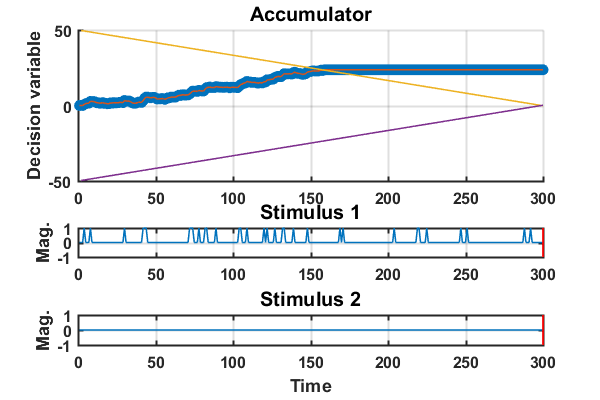
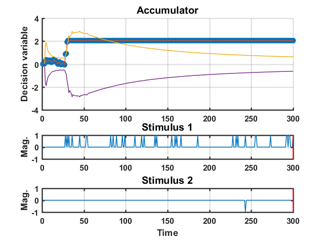
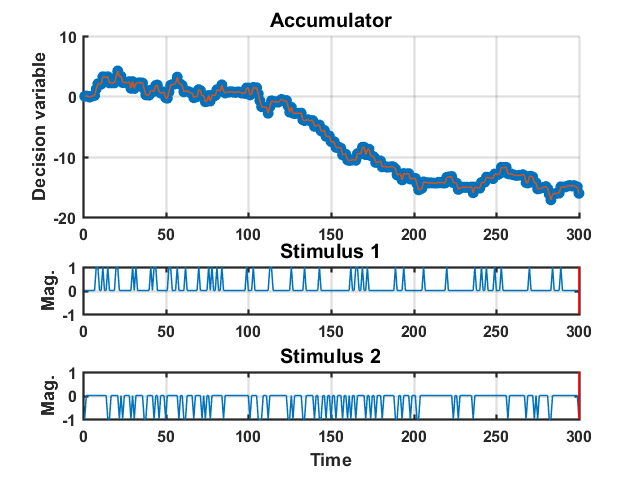
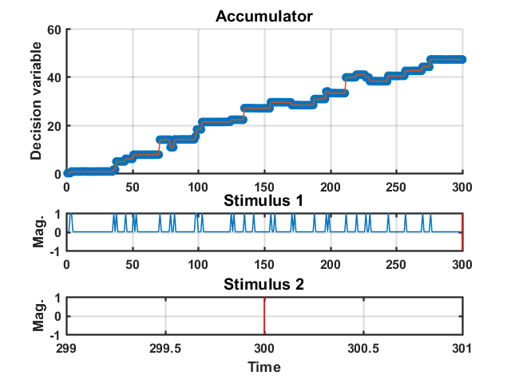
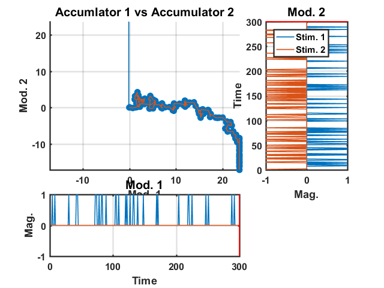

# DriftDiffusion

Drift Diffusion decision accumulator class for Matlab.
Models accumulation of uni or bi-directional sensory information and integration across modalities.

# Introduction

Drift diffusion models are extensions of random walk models that consist of an accumulator that has incoming sensory information added to it over time. They are often used to model behavioural performance in two-forced alternative choice psychophysics tasks, and have a number of general parameters that can represent behaviour of the accumulation system, such as:
 - Decision bounds - the threshold of evidence required to reach a decision
 - Reaction times - how long it takes to reach a decision threshold
 - Memory - the "leakiness" of the accumulator
 - Adaptation - weighting of new stimulus information based on stimulus history
 - Accumulator noise
 - Sensory noise
 - Robustness of accumulator

The code in this repository is a work-in-progress implementation of a number of drift diffusion models, and the mechanisms by which information from multiple models can be combined to be used in a multisensory context.

Generally; drift diffusion (DD) objects can be created to represent an individual sensory modality (comprising an accumulator history, sensory input and binary decision) and then combined in to a multiDD object that models the multisensory combination of information and makes an overall decision. This is analogous to late sensory integration in cortex - see [JK Bizley, GP Jones, SM Town, 2013](https://scholar.google.co.uk/citations?view_op=view_citation&hl=en&user=cU1sBXcAAAAJ&citation_for_view=cU1sBXcAAAAJ:3s1wT3WcHBgC). 

This documentation is not complete, so see example scripts below. The MultiDDExamples.m runs simple experiments that assess discrimination performance in unisensory and multisensory conditions.

# Unisensory decisions

DD objects can be created using the following drift diffusion and decision bound models. The accumulation model deals with the accumulator and incoming sensory information, while the decision bound model determines the point at which the model will stop. See **DDExamples.m** for usage examples.


## Accumulation models
- **ARGuass** - Simple auto regressive model, no stimuli
- **Delta1D** - Stimulus in one direction and accumulator noise
- **Delta2D**- Stimulus in two directions and accumulator noise
- **BB1D** - Basic implementation of [Brunton et.al, 2013](http://science.sciencemag.org/content/340/6128/95) Stimulus in one direction with accumulator and sensory noise. No adaptation.
- **BB2D** - Basic implementation of [Brunton et.al, 2013](http://science.sciencemag.org/content/340/6128/95) Stimulus in two directions with accumulator and sensory noise. No adaptation.
- **BruntonFull** - Not implemented yet


## Decision bound models 
- **None** - DD object runs to end (specified by params.its)
- **Static** - Decision bounds remain constant throughout 
- **LinearDecay** - Decision bound decays linearly
- **ExpDecay** - Decision bound decays exponentially 
- **SE** - Decision updates depending on variability (noise) in accumulator
- **Custom**

## Examples

### 1
  - Sensory information in two directions
  - Accumulator noise (no sensory noise)
  - Linearly decaying decision bounds (using custom function)

```MATLAB
% Params
params1.model = 'Delta2D'; % Accumulator model
params1.plotSpeed = 5; % Plot every x iterations
params1.its = 300;
params1.aSig = 0.25; % Accumulator noise magnitude
params1.aMu = 0;  % Accumulator noise bias
params1.aLam = 1; % Autoregressive parameter (0<1, accumulator becomes leaky)
params1.fig = figure;
params1.decBound = 50; % Initial decision bound magnitude
% The decision bounds in this example decay linearlly, which can be
% specified with .decBoundMode = 'Linear'. However, below is an example of
% doing the same thing by specifying a custom function.
params1.decBoundMode = 'Custom';
params1.decFunc = @(dbs,dbe,its,it) ...
    dbs - it*((dbs-dbe)/(its-1));
params1.decFuncParams = [params1.decBound, 0, its];

% Stims
% Generate random stimuli
stim1.delta1 = rand(1,its)>0.88; 
stim1.delta2 = 0 - (rand(1,its)>0.99);

% Create object
DD1 = DD(params1, stim1);
% Run object
DD1 = DD1.run();
```



### 2
  - Sensory information in two directions
  - Accumulator noise (no sensory noise)
  - Decision bounds vary depending on accumulator noise

```MATLAB
% Params
params2.model = 'Delta2D';
params2.plotSpeed = 5;
params2.its = its;
params2.aSig = 0.1;
params2.aMu = 0;
params2.aLam = 1;
params2.fig = figure;
params2.decBoundMode = 'SE';
params2.decBoundSEMulti = 1000;

% Stims
stim2.delta1 = rand(1,its)>0.87;
stim2.delta2 = 0-(rand(1,its)>0.99);

% Create object
DD2 = DD(params2, stim2);
% Run object
DD2 = DD2.run(its);
```


### 3
  - Sensory information in two directions
  - Accumulator noise (no sensory noise)
  - No decision bounds

```MATLAB
clear params3
% Params
params3.model = 'Delta2D';
params3.plotSpeed = 5;
params3.its = its;
params3.aSig = 0.1;
params3.aMu = 0;
params3.aLam = 1;
params3.fig = figure;

% Stims
stim3.delta1 = rand(1,its)>0.87;
stim3.delta2 = 0-(rand(1,its)>0.80);

% Create object
DD3 = DD(params3, stim3);
% Run objec
DD3 = DD3.run(its);
```


### 4
 - Stimulus in one direction
 - Brunton 2013 model, without adaptaion
 - No decision bounds
 - Adds robustness to accumulator

```MATLAB
% Params
params5.model = 'BB1D';
params5.plotSpeed = 5;
params5.its = its;
params5.aSig = 0.01;
params5.sMu = 1;
params5.sSig = 2;
params5.aMu = 0;
params5.aLam = 1;
params5.fig = figure;

params5.decBoundMode = 'Off';

% params5.robust = 'Off'
params5.robust = 'Threshold';
params5.robustOpts.thresh = 0.6;

% Stims
stim5.delta1 = rand(1,its)>0.88; 

% Create object
DD5 = DD(params5, stim5);
% Run object
DD5 = DD5.run();
```


# Multisensory decisions

Two (or more) DD objects can be combined to create a multiDD object that makes a binary decision based on the output on the result of the DD objects. See **MultiDDExamples.m** for usage examples

## Examples
### Plotting two DD objects
   - Using DD1 and DD3 from unisensory examples:
```MATLAB
DD1.plotDD2(DD3)
```


### Creating MultDD object
 - See MultiDDExamples.m

# Files

## Classes

- **DD.m** - Creates an object that can be used to run and plot a drift diffusion model over a specified number of iterations. 
- **DDp.m** - (Not working yet and possibly not worth effort, might be binned)
Creates a 'perpetual' DD model that can generate additional iterations as needed. No preallocation, all calculations done on each iteration so slower.
- **multiDD.m** - Combines multiple DD objects into multisensory/multimodal decision - not added yet.
- **Experiments** - simple discrimination experiments to test out the decision system. 
## Other functions
 - **FitPsychCurve.m** - Psychometric model fitting based on [Wichmann and Hill 2001](http://wexler.free.fr/library/files/wichmann%20(2001)%20the%20psychometric%20function.%20i.%20fitting,%20sampling,%20and%20goodness%20of%20fit.pdf) and forked from [PsycometricCurveFittin repo](https://github.com/garethjns/PsychometricCurveFitting). Used to assess "behaviour" and estimate discrimination threshold and bias.

## Examples
- **DDExamples.m** - Examples for creating unisensory DD objects with different combinations of accumulator models, decision bound models, and sensory information
- **MultiDDExamples.m** - Examples of combining DD objects in to multiDD objects and running experiments to test decision behaviour
